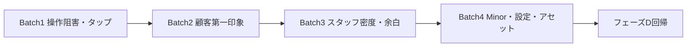

# 改善実行PLAN（UI/UX フェーズ D 対応）

> **北極星（必読）:** [プロダクト認識と理想UIUX.md](./プロダクト認識と理想UIUX.md)  
> 入力: [UIUX修正点まとめ.md](./UIUX修正点まとめ.md)  
> 実行手順の元: [UIUXフェーズD実行チェックリスト.md](./UIUXフェーズD実行チェックリスト.md)  
> 親: [本番前テストPLAN.md](./本番前テストPLAN.md) / [本番環境構築ガイド.md](./本番環境構築ガイド.md)

**本ドキュメントは実装着手用。** 実装前にプロダクト認識ドキュメントと矛盾しないか確認すること。  
認識ズレ（ホームが巨大フォルダ、LINE紐付けが見えない等）は、タップ領域修正より **オペレーターUI再設計を優先**してよい。

---

## 0. 認識に基づく実装優先（更新）

[プロダクト認識と理想UIUX.md](./プロダクト認識と理想UIUX.md) 合意後の優先順:

| 順 | 内容 | 備考 |
| --- | --- | --- |
| 1 | ホームを「今週の仕事」に再設計 | 要対応（LINE紐付・失敗）＋緊急度付き候補行 |
| 2 | LINE 紐付け導線をホームから到達可能に | 店舗語のラベル |
| 3 | 顧客カードの識別情報（ナンバー等） | 切れない・LINE可否の印 |
| 4 | 履歴を失敗直しに寄せる | 巨大ホームボタン縮小 |
| 5 | フェーズ D のタップ・ポータル見た目 | 既存 Batch 1–2 と統合可 |

テンプレ文面・見積手動編集は **大きく触らない**（オーナー後出し・現状で足りる）。

---

## 1. 目的・前提

- フェーズ D で検出した Major / Minor を、納品品質まで引き上げる。
- 加えて、**案内オペレーターとしての情報設計**をホーム中心に戻す。
- Blocker は 0 件。**「分からない・見つからない」を先に潰す。**
- デモ本番の設定不足（発行者 JSON・サンプル画像）は構築ガイド側の作業と並行可能。

### 優先度ルール

1. Blocker（今回なし）
2. オペレーター導線（ホーム・LINE紐付・顧客識別）
3. Major（顧客向け見た目・タップ・可読性）
4. Minor
5. 要実機確認で NG になったもの → 操作阻害 Batch に繰り上げ

---

## 2. 実装バッチ概要



| Batch | 対応 ID | 目安 |
| --- | --- | --- |
| 1 | F-02, F-03, F-06, F-11 | CSS / プレビュー枠 |
| 2 | F-01, F-04, F-08 | ポータル・見積書 |
| 3 | F-12, F-13 + スタッフ面再テストで出た NG | dialog / シート |
| 4 | F-05, F-07, F-09, F-10 | 設定・画像・文言 |

---

## 3. Batch 1 — 操作阻害・タップ領域

### 変更内容

| # | 作業 | 対象ファイル |
| - | --- | --- |
| 1-1 | モバイルで `.quote-cta-btn` / `.portal-cta` を **min-height: 44px**、padding 調整 | `src/app/globals.css` |
| 1-2 | モバイルで `.btn-sm` を **min-height: 44px**（または主要導線を `.btn` に変更） | `globals.css` / 該当コンポーネント |
| 1-3 | `.btn-nav-compact` / `.page-back` を **≥40px**（理想 44px） | `globals.css` |
| 1-4 | 送信プレビューの `phone-frame` をやめ、枠なし or 軽枠スクロールに変更 | `customer-portal-preview-frame.tsx`、`globals.css` |

### 受け入れ条件

- [x] ポータル CTA・送信シート主要ボタンが指で押しやすい
- [x] ログアウト・戻るが誤タップしにくい
- [x] 送信シート内プレビューで二重スクロールが解消
- [ ] チェックリスト: P1-3-T, P0-2-PF, P2-4-BTN, RISK-3, RISK-5, RISK-7（スタッフログイン実機は別途）

---

## 4. Batch 2 — 顧客第一印象・見積可読性

### 変更内容

| # | 作業 | 対象ファイル |
| - | --- | --- |
| 2-1 | ポータルヘッダーに `issuer.companyName` を表示（未設定時は非表示） | `customer-portal-view.tsx`、`globals.css` |
| 2-2 | 見積書スマホでも数量・単価列を表示（フォント縮小可）。または短い画面注記 | `globals.css`、必要なら `quote-document.tsx` |
| 2-3 | ポータルの `quote_no` を短縮表示（title に全文） | `portal-quote-card.tsx` |

### 受け入れ条件

- [x] 第一画面で店名（設定時）・顧客名・車種が分かる
- [x] `/q/` スマホで内訳根拠が追える
- [x] 見積番号がヘッダーを圧迫しない
- [ ] チェックリスト: P1-3-V, P1-4-$, P1-4-COL, RISK-4, RISK-6, F-08（公開面の実機スクショ再確認は任意）

---

## 5. Batch 3 — スタッフ面・dialog 回帰

### 前提

スタッフログイン可能な環境で [UIUXフェーズD実行チェックリスト.md](./UIUXフェーズD実行チェックリスト.md) の **P0 全項目 + RISK-1/2** を実施。

### 変更内容（NG が出た場合）

| # | 想定作業 | 対象ファイル |
| - | --- | --- |
| 3-1 | dialog 閉鎖後のタップ阻害が再発していれば、open/close 同期と CSS を再点検 | `use-modal-dialog.ts`、`globals.css` |
| 3-2 | 送信↔見積ネストでナビが死ぬ場合、シート open 状態の排他を整理 | `send-notification-sheet.tsx`、`quote-editor-sheet.tsx` |
| 3-3 | Save bar + キーボードで入力が隠れる場合、padding / scrollIntoView | `quote-editor-card.tsx`、`quote-save-bar.tsx`、`globals.css` |
| 3-4 | 一括バーと BottomNav の重なり調整 | `target-list.tsx`、`globals.css` |

### 受け入れ条件

- [ ] P0-2-D1 / P0-2-D2 / RISK-1 / RISK-2 が OK
- [ ] 見積編集中も保存・ナビが使える
- [ ] リスト一括バーで誤タップしない

> 実機で問題なしなら Batch 3 のコード変更はスキップし、「回帰 OK」と [UIUX修正点まとめ.md](./UIUX修正点まとめ.md) に追記する。

---

## 6. Batch 4 — Minor・設定・アセット

| # | 作業 | 担当 | 対象 | 状態 |
| - | --- | --- | --- | --- |
| 4-1 | Vercel に `NEXT_PUBLIC_ISSUER_JSON` を設定し Redeploy（F-05） | 開発 + クライアント情報 | 環境変数 | **クライアント待ち** |
| 4-2 | `/info/maintenance` 画像から「サンプル」を除去し店舗価格に差し替え（F-07） | クライアント提供 → 開発 | `public/info/maintenance/` | **クライアント待ち** |
| 4-3 | ラベル字号・コントラスト微調整（F-09） | 開発 | `globals.css` | **対応済**（12px） |
| 4-4 | 敬称「さん/様」をクライアント確認後に変更（F-10） | 双方 | `customer-portal-view.tsx` | **現状維持** |

### 受け入れ条件

- [ ] ポータルに電話 CTA / 見積書に発行者
- [ ] 整備費用一覧がサンプル表記でない
- [ ] 敬称が店舗方針と一致

---

## 7. 実装後の再テスト手順

1. Batch ごとに関連チェック項目のみ再実行（上記受け入れ条件）。
2. 全 Batch 完了後、[UIUXフェーズD実行チェックリスト.md](./UIUXフェーズD実行チェックリスト.md) の P1-3 / P1-4 / RISK を一通り。
3. スタッフ面はログイン環境で P0 を再実行。
4. 結果を [UIUX修正点まとめ.md](./UIUX修正点まとめ.md) のステータス列に「対応済」を追記（任意）。
5. [本番前テストPLAN.md](./本番前テストPLAN.md) フェーズ D 完了判定へ進む。

---

## 8. 他ドキュメントとの関係

| ドキュメント | 関係 |
| --- | --- |
| [本番環境構築ガイド.md](./本番環境構築ガイド.md) | F-05（発行者 JSON）・アセット差し替え・本番 GO |
| [本番前テストPLAN.md](./本番前テストPLAN.md) | フェーズ D の詳細実行と完了判定 |
| [acceptance-checklist.md](./acceptance-checklist.md) | 受入会での顧客ポータル・見積表示確認 |

---

## 9. 実装セッションでの着手順（コピペ用）

```text
1. Batch 1: globals.css のタップ領域 + customer-portal-preview-frame 簡素化
2. Batch 2: ポータル店舗名 + quote_no 短縮 + 見積書スマホ列
3. スタッフログインで P0 / RISK-1,2 を実行 → 必要なら Batch 3
4. Batch 4: 環境変数・画像・文言（クライアント待ちはブロックにしない）
5. 回帰テスト → 修正点まとめを更新
```

---

## 10. 対応状況（2026-07-25 実装セッション）

案内オペレーター UI 実装PLAN（ホーム再設計 + フェーズ D）をコード反映済み。

| 領域 | 状態 | 内容 |
| --- | --- | --- |
| ホーム再設計 | **対応済** | 要対応（LINE未登録・送信失敗）＋コンパクト候補行。「今週の案内」 |
| LINE 導線 | **対応済** | ホーム最上段から `/line/unmatched` |
| 顧客カード | **対応済** | ナンバー優先・LINE済/なし印・密度上げ |
| 履歴導入部 | **対応済** | 巨大ホーム CTA をテキストリンク化 |
| Batch 1（F-02/03/06/11） | **対応済** | タップ 44px、phone-frame 廃止 |
| Batch 2（F-01/04/08） | **対応済** | 店舗名・見積列表示・quote_no 短縮 |
| F-09 | **対応済** | 暗背景ラベル 12px |
| F-05 / F-07 | **未着手（待ち）** | Vercel 発行者 JSON・整備費用画像 |
| F-10 | **現状維持** | さん/様 |
| F-12 / F-13 | **要実機** | スタッフログイン後の dialog / シート回帰 |
| `npm test` | **通過** | 2026-07-25 |

---

_最終更新: 2026-07-25 案内オペレーター UI 実装反映_
