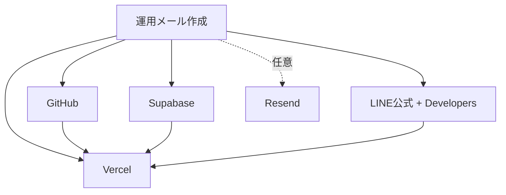

# 本番環境構築ガイド（Shaken Notify / kurumakanri）

> クライアント名義のメールアドレスで **すべてのアカウントをゼロから作成し、本番運用を開始する** ための統合ガイドです。
> 旧: `本番向け残り作業20260620.md` / `account-checklist.md` / `production-rehearsal-checklist.md` を一本化しました。
> 運用フェーズの資料は別途: [weekly-ops-runbook.md](./weekly-ops-runbook.md) / [operation-manual.md](./operation-manual.md) / [incident-escalation-flow.md](./incident-escalation-flow.md) / [faq.md](./faq.md)
> 受入・テストは別紙: [本番前テストPLAN.md](./本番前テストPLAN.md) / [UIUXフェーズD実行チェックリスト.md](./UIUXフェーズD実行チェックリスト.md) / [改善実行PLAN.md](./改善実行PLAN.md) / [acceptance-checklist.md](./acceptance-checklist.md)

---

## 目次

1. [前提とゴール](#1-前提とゴール)
2. [役割分担（クライアント / 開発）](#2-役割分担クライアント--開発)
3. [アカウント作成の順番](#3-アカウント作成の順番)
4. [クライアント側の準備作業](#4-クライアント側の準備作業)
5. [サービス別セットアップ手順（開発側）](#5-サービス別セットアップ手順開発側)
   - 5.1 GitHub
   - 5.2 Supabase
   - 5.3 Vercel
   - 5.4 LINE（Messaging API）
   - 5.5 メール（Resend・任意）
6. [環境変数リファレンス](#6-環境変数リファレンス)
7. [店舗データの投入](#7-店舗データの投入)
8. [デモ環境からの切り替え・解約](#8-デモ環境からの切り替え解約)
9. [疎通確認と本番 GO 判定](#9-疎通確認と本番-go-判定)
10. [引き渡し](#10-引き渡し)
11. [よくあるつまずき](#11-よくあるつまずき)

---

## 1. 前提とゴール

### 今回の方針（確定）

- クライアントが **運用メールアドレス** を新規作成する。
- そのメールで **すべてのクラウドアカウント**（GitHub / Supabase / Vercel / LINE /（任意）Resend）を作成する。
- **公式 LINE** もクライアント名義で新規開設する。
- ベンダー名義の **既存 Supabase は解約予定** → 本番は新規プロジェクトに作り直す。
- デモ URL `https://kurumakanri.vercel.app` は検証用。本番はクライアント環境へ載せ替える。

### ゴール

- クライアント名義のインフラ一式で、スタッフがログインでき、顧客へ LINE 通知が届き、顧客が専用ページ（`/p/...`）で見積・整備履歴を確認できる状態。

### アプリ構成（概要）

| 要素 | 技術 | 役割 |
| --- | --- | --- |
| フロント / API | Next.js 14（App Router） | 管理画面・顧客ページ・Webhook |
| DB / 認証 | Supabase（Postgres + Auth + RLS） | 顧客・車両・見積・通知ジョブ |
| ホスティング | Vercel | 本番デプロイ |
| 通知 | LINE Messaging API / （任意）Resend | 顧客への配信 |

---

## 2. 役割分担（クライアント / 開発）

| 記号 | 担当 |
| --- | --- |
| ■ | クライアント（店舗側） |
| ▲ | 開発側（ベンダー） |
| ■▲ | 双方 |

大枠:

- **■ クライアント**: アカウント作成・課金・店舗情報/費用/顧客データの提供・公式 LINE 運用・文面の最終確認
- **▲ 開発**: マイグレーション適用・環境変数設定・Webhook 設定・データ投入支援・疎通確認・引き渡し

> 開発側がクライアント作業を代行・同席支援する場合も、**アカウントの所有者はクライアント**である点を維持します（退職・契約終了時の引き継ぎのため）。

---

## 3. アカウント作成の順番

依存関係の少ない順に作るとスムーズです。

```text
1. 運用メールアドレス（すべての起点）
2. GitHub          … ソース保管・Vercel 連携
3. Supabase        … DB・認証（本番プロジェクト）
4. Vercel          … デプロイ（GitHub と連携）
5. LINE 公式 + Developers … 通知チャネル
6. （任意）Resend + ドメイン DNS … メール通知
```



---

## 4. クライアント側の準備作業

### 4-A. アカウント・契約（■）

| # | 作業 | 目安 | 備考 |
| - | --- | --- | --- |
| A-1 | 運用メールアドレス作成 | 15分 | 共有受信できる形が望ましい（担当交代に強い） |
| A-2 | GitHub アカウント作成 | 15分 | 開発側をコラボレーターに招待 |
| A-3 | Supabase アカウント + 本番プロジェクト（Tokyo） | 30分 | 課金はクライアント名義 |
| A-4 | Vercel アカウント作成 | 15分 | GitHub 連携 |
| A-5 | LINE 公式アカウント開設 | 30分 | [LINE for Business](https://www.linebiz.com/jp/) |
| A-6 | LINE Developers で Messaging API チャネル作成 | 20分 | ライトプラン以上 |
| A-7 | （任意）Resend 等メール送信サービス契約 | 15分 | 顧客メール通知を使う場合のみ |
| A-8 | （任意）本番独自ドメイン | - | 例: `shaken.店舗.jp` |

### 4-B. 情報・データの提供（■ → ▲）

| # | 提供物 | 用途 |
| - | --- | --- |
| B-1 | **法定費用**の実数値（自賠責・重量税・印紙・代書料など。軽/普通 × エコ区分） | `statutory_fee_rates` に反映 |
| B-2 | **整備・工賃**の店舗標準単価（24ヶ月点検基本料・オイル交換など） | 見積自動生成の既定値 |
| B-3 | **整備費用一覧**の参考価格・画像 | `/info/maintenance` 差し替え |
| B-4 | **店舗情報**（店名・住所・電話・登録番号） | 見積書・ポータル表示（`NEXT_PUBLIC_ISSUER_JSON`） |
| B-5 | **実顧客データ**（氏名・連絡先・車両・満了日・走行距離） | 顧客投入 |
| B-6 | **スタッフのログイン用メール一覧** | Supabase Auth |
| B-7 | **障害時連絡先** | 管理画面ヘルプ表示 |

### 4-C. LINE 運用（■）

| # | 作業 | 備考 |
| - | --- | --- |
| C-1 | Channel access token / Channel secret を開発側へ安全に共有 | パスワードマネージャ推奨。チャット貼り付け・メール添付は避ける |
| C-2 | 友だち追加 QR を店頭・Web で案内 | 顧客の `line_user_id` 取得の入口 |
| C-3 | 友だち追加後の顧客紐付けフローを決める | 例: 氏名 + ナンバーでスタッフが登録 |

### 4-D. 文面・運用（■ / ■▲）

| # | 作業 | 備考 |
| - | --- | --- |
| D-1 | 通知文面（車検リマインド等）の最終文言確認 | `/templates` を店舗目線で |
| D-2 | 週次運用の担当・バックアップ担当の決定 | [weekly-ops-runbook.md](./weekly-ops-runbook.md) |
| D-3 | 配信停止依頼の社内対応フロー合意 | [operation-manual.md](./operation-manual.md) |

### セキュリティ共有ルール

- API キー / トークンは **パスワードマネージャ（Bitwarden / 1Password 等）経由**で共有。
- メール添付・チャット貼り付けは避ける。

---

## 5. サービス別セットアップ手順（開発側）

### 5.1 GitHub（▲）

1. クライアント GitHub にリポジトリを作成（またはクライアントへ移管）。
2. 開発側をコラボレーターに追加。
3. `main` を本番連携ブランチにする。

### 5.2 Supabase（▲）

1. クライアントの本番プロジェクト（リージョン **Tokyo**）を使う。
2. マイグレーションを **番号順に全件適用**（SQL Editor か CLI）。

   ```text
   0001_init_schema.sql
   0002_views_and_helpers.sql
   0003_rls.sql
   0004_audit_logs_insert_policy.sql
   0005_priority_tasks.sql
   0006_hotfix_priority_and_rls.sql
   0007_line_unmatched_view.sql
   0008_quotes_extended_statutory.sql
   0009_template_v2_info_urls.sql
   0010_campaign.sql
   0011_template_v3_amount.sql
   0012_new_rules.sql
   0014_notify_legal_primary.sql
   0015_portal_url_templates.sql
   0016_portal_primary_link.sql
   0017_line_test_customer_180days.sql   ← テスト用。本番では投入判断
   ```

   > CLI の場合: `supabase link` 後に `supabase db push`。
   > `0017` は LINE テスト顧客の seed。本番稼働時は不要なら適用しない or 後で削除。

3. `staff_profiles` に管理者ユーザーを紐付け（これがないとログイン不可）。
4. API Keys を控える: `Project URL` / `anon (publishable)` / `service_role`。
5. バックアップ間隔を確認（既定: 毎日自動）。

### 5.3 Vercel（▲）

1. GitHub リポジトリを Import。
2. Framework: Next.js（自動検出）。
3. **Environment Variables**（[第6章](#6-環境変数リファレンス)）を Production に設定。
4. Deploy。環境変数変更後は必ず **Redeploy**。
5. `/login` と `/dashboard` の表示を確認。
6. （任意）独自ドメイン接続 → `NEXT_PUBLIC_SITE_URL` をそのドメインに更新。

### 5.4 LINE（Messaging API）（▲）

1. Vercel 本番 URL で **Webhook URL** を登録: `https://（本番ドメイン）/api/webhooks/line`
2. Webhook を **有効化**。
3. **応答メッセージ**は用途に応じて OFF（配信は API から Push）。
4. `LINE_CHANNEL_ACCESS_TOKEN` / `LINE_CHANNEL_SECRET` を Vercel に設定。
5. テスト友だち追加 → `audit_logs.action='line.follow_unmatched'` にログが残るか確認。

### 5.5 メール（Resend・任意）（■▲）

1. Resend アカウント作成、送信元ドメインを所有確認。
2. DNS に SPF / DKIM / DMARC を設定（レジストラ管理画面）。
3. `RESEND_API_KEY` / `MAIL_FROM` を Vercel に設定。
4. 送信元（From）・返信先を確定。

---

## 6. 環境変数リファレンス

Vercel → Project → **Settings → Environment Variables → Production** に設定し、**Redeploy**。
参照: [.env.example](../.env.example)

| 変数名 | 必須 | 内容 |
| --- | --- | --- |
| `NEXT_PUBLIC_SUPABASE_URL` | ○ | Supabase プロジェクト URL |
| `NEXT_PUBLIC_SUPABASE_ANON_KEY` | ○ | 公開 anon / publishable キー |
| `SUPABASE_SERVICE_ROLE_KEY` | ○ | サーバー専用（**ブラウザに出さない・漏洩厳禁**） |
| `NEXT_PUBLIC_SITE_URL` | ○ | 本番 URL（例 `https://shaken.店舗.jp`）。**末尾 `/` なし** |
| `LINE_CHANNEL_ACCESS_TOKEN` | ○ | 本番 LINE チャネルのトークン |
| `LINE_CHANNEL_SECRET` | ○ | Webhook 署名検証用 |
| `OPT_OUT_SECRET` | ○ | 配信停止リンク署名（**本番用ランダム文字列**） |
| `QUOTE_SHARE_SECRET` | ○ | 見積詳細 `/q/...` 署名 |
| `CUSTOMER_PORTAL_SECRET` | ○ | 顧客ポータル `/p/...` 署名 |
| `NEXT_PUBLIC_ISSUER_JSON` | 推奨 | 見積書・ポータルの店舗情報（JSON 1 行） |
| `NEXT_PUBLIC_OPS_MANAGER_CONTACT` | 推奨 | 障害時の表示用連絡先 |
| `RESEND_API_KEY` | メール時 | Resend API キー |
| `MAIL_FROM` | メール時 | 送信元アドレス |
| `AUTO_SEND_ENABLED` | ○ | **`false` のまま**（自動送信は運用慣れ後） |
| `NOTIFICATION_IDEMPOTENCY_DISABLED` | × | **本番では設定しない**（同日再送防止を有効化） |

> シークレット 3 種（`OPT_OUT_SECRET` / `QUOTE_SHARE_SECRET` / `CUSTOMER_PORTAL_SECRET`）は **それぞれ別の**十分に長いランダム文字列にする。`.env.example` の `replace-with-...` は必ず差し替える。

---

## 7. 店舗データの投入

| # | 作業 | 方法 |
| - | --- | --- |
| 7-1 | 法定費用を店舗の実数値に更新 | 管理画面 `/admin/statutory`（ADMIN）または SQL |
| 7-2 | 整備単価・見積既定を調整 | 見積生成ロジックの既定値 + DB を確認 |
| 7-3 | `/info/maintenance` の画像・文言を店舗向けに更新 | `public/info/maintenance/` を差し替え |
| 7-4 | 実顧客データ投入 | CSV 取り込み or 管理画面から手入力 |
| 7-5 | スタッフアカウント発行 | Supabase Auth にユーザー作成 → `staff_profiles` 紐付け |
| 7-6 | 店舗情報の反映 | `NEXT_PUBLIC_ISSUER_JSON` |

---

## 8. デモ環境からの切り替え・解約

| # | 作業 | 注意 |
| - | --- | --- |
| 8-1 | 旧（ベンダー名義）Supabase から **移行データの要否**を確認 | 必要なデータは事前にエクスポート |
| 8-2 | 本番 Supabase で全マイグレーション + 実データ投入が完了しているか確認 | 8-3 の前提 |
| 8-3 | 旧 Supabase プロジェクトの解約 | **本番稼働・バックアップ確認後**に実施 |
| 8-4 | デモ Vercel（`kurumakanri.vercel.app`）の扱いを決定 | 停止 or 検証用に残す |
| 8-5 | デモ用の `NOTIFICATION_IDEMPOTENCY_DISABLED` が本番に無いことを確認 | 誤設定防止 |
| 8-6 | `0017` などテスト seed 顧客の整理 | 本番に不要なら削除 |

---

## 9. 疎通確認と本番 GO 判定

詳細な機能テストは [本番前テストPLAN.md](./本番前テストPLAN.md) を実施。ここでは最終ゲートのみ。

### インフラ

- [ ] Vercel 本番環境変数が `.env.example` どおり揃っている
- [ ] `NOTIFICATION_IDEMPOTENCY_DISABLED` が本番に無い
- [ ] `NEXT_PUBLIC_SITE_URL` が本番 URL（`localhost` ではない）
- [ ] シークレット 3 種が仮値ではない
- [ ] Supabase マイグレーションが最新まで適用済み

### 機能

- [ ] スタッフが本番 URL でログインできる
- [ ] 実顧客（またはテスト顧客）へ LINE 通知が届く
- [ ] LINE 内リンク（`/p/...`・`/info/maintenance`）がスマホで開ける
- [ ] 見積詳細（`/q/...`）がポータルから開ける
- [ ] 同日同ルールの再送がブロックされる（冪等キー）
- [ ] 送付履歴に SUCCESS / FAILED が記録される

### データ・運用

- [ ] 法定費用・整備単価が店舗の実態に合っている
- [ ] デモ / テスト seed データが整理されている
- [ ] スタッフアカウントが発行されている
- [ ] 週次 Runbook の担当者が決まっている
- [ ] 受入チェックリストが記入済み

---

## 10. 引き渡し

| # | 作業 | 参照 |
| - | --- | --- |
| 10-1 | [本番前テストPLAN.md](./本番前テストPLAN.md) 実施 | 機能テスト |
| 10-2 | [acceptance-checklist.md](./acceptance-checklist.md) を本番 URL で実施 | クライアント同席推奨 |
| 10-3 | [weekly-ops-runbook.md](./weekly-ops-runbook.md) を担当者へ説明 | 週次送付フロー |
| 10-4 | [incident-escalation-flow.md](./incident-escalation-flow.md) 共有 | 障害時連絡 |
| 10-5 | アカウント権限の最終確認（Supabase / Vercel / GitHub / LINE） | すべてクライアント名義・管理者権限 |

---

## 11. よくあるつまずき

| 症状 | 確認ポイント |
| --- | --- |
| LINE 本文が `localhost` | Vercel の `NEXT_PUBLIC_SITE_URL` + Redeploy |
| 「送信しました」だが LINE が来ない | 同日再送（冪等キー）。レスポンスの `results[].message` を確認 |
| 本番だけ LINE 失敗 | `LINE_CHANNEL_ACCESS_TOKEN` が Vercel 未設定 |
| リンクが `/me?cid=` のまま | `CUSTOMER_PORTAL_SECRET` / `QUOTE_SHARE_SECRET` 未設定 |
| 顧客に送れない | `line_user_id` 未登録・LINE 未友だち追加 |
| ログインできない | `staff_profiles` にユーザーが紐付いていない |
| 送信処理が例外で落ちる | `OPT_OUT_SECRET` 未設定 |

---

_最終更新: クライアント名義移行方針の確定時。旧 3 ドキュメント（本番向け残り作業 / account-checklist / production-rehearsal-checklist）を本ガイドに統合。_
